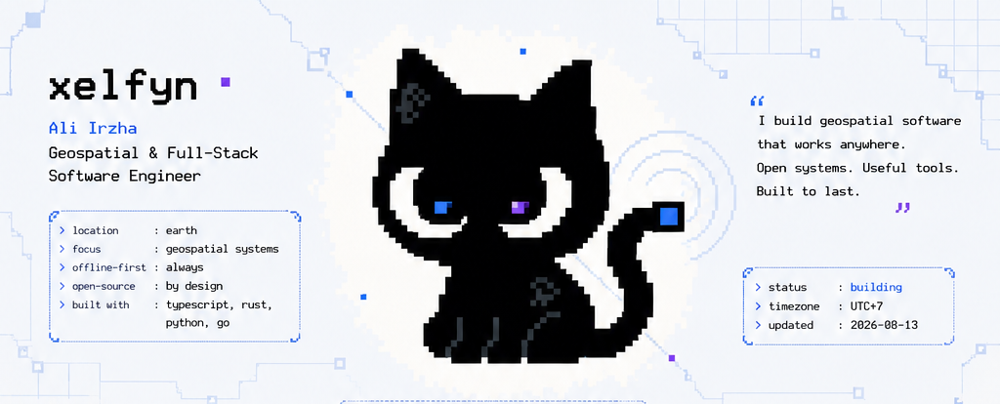
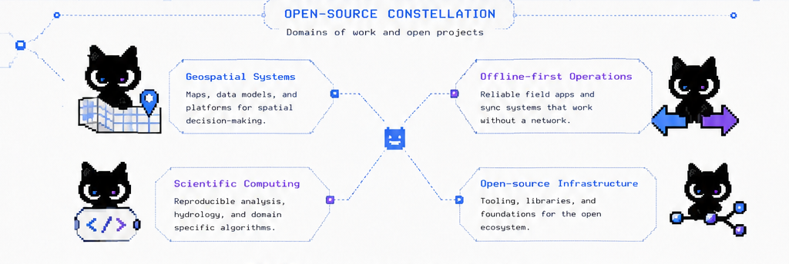
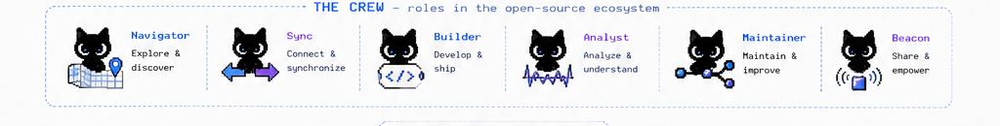
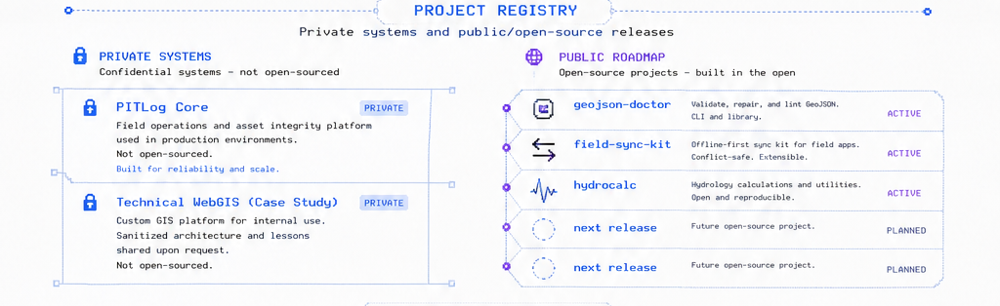
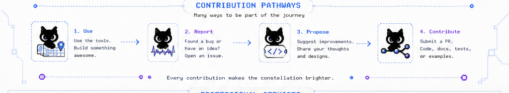
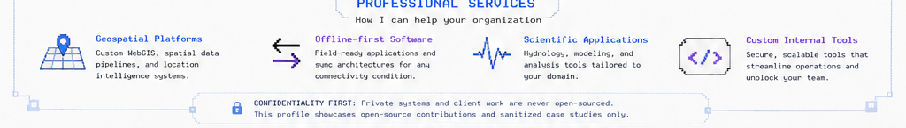

  <a href="#open-source-constellation">Constellation</a> ·
  <a href="#project-registry">Projects</a> ·
  <a href="#contribution-pathways">Contribute</a> ·
  <a href="#professional-services">Services</a>

| Private systems | Public roadmap |
| --- | --- |
| **PITLog Core** — offline-first field operations and asset-integrity platform. Implementation remains private. | **geojson-doctor** — GeoJSON validation, diagnostics, and repair tooling. `concept` |
| **Technical WebGIS** — sanitized case study for spatial data, technical mapping, and decision support. | **field-sync-kit** — offline-first synchronization reference for field applications. `concept` |
| Client data, credentials, operational interfaces, and commercial source code are never published. | **hydrocalc** — reproducible hydrogeology and hydrology calculations. `planned` |

Public repositories will provide contribution instructions after their first release. Until then, discussion is welcome through the relevant repository once it becomes available.

Available for selected software engagements through **CV Geotama Multi Resource**. Private systems and client work are never open-sourced; this profile contains public tools and sanitized case studies only.

Indonesia · UTC+7 · Building reliable signals that last.

