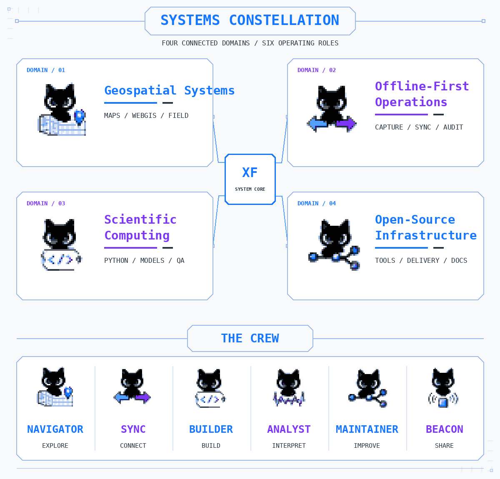

# xelfyn

**Ali Irzha**  
Geospatial & Full-Stack Software Engineer

I build field-ready geospatial, operational, and scientific systems—from data capture to technical decision support.

<picture>
  <source media="(prefers-reduced-motion: reduce)" srcset="./assets/v1/hero/xelfyn-field-journal-static-v1.png">
  
</picture>

**Earth · UTC+7 · Selective availability**

[Systems Constellation](#systems-constellation) · [Selected Systems](#selected-systems) · [Engineering Focus](#engineering-focus) · [Collaboration](#services--collaboration)

---

## Systems Constellation

Four connected domains for field systems, scientific work, and maintainable software.

<picture>
  <source media="(prefers-color-scheme: dark)" srcset="./assets/v1/constellation/systems-constellation-dark-v1.png">
  
</picture>

### Four domains

- **Geospatial Systems** — WebGIS, spatial models, map interfaces, geospatial APIs, and field-ready decision platforms.
- **Offline-First Operations** — Reliable capture, synchronization, validation, and auditability under unstable connectivity.
- **Scientific Computing** — Reproducible Python processing, modelling, validation, and technical interpretation.
- **Open-Source Infrastructure** — Reusable tooling, deterministic reporting, maintainable delivery, and public technical artifacts.

### The Crew

- **Navigator** — Explore and frame field and spatial problems.
- **Sync** — Design reliable offline and online continuity.
- **Builder** — Deliver end-to-end software across system boundaries.
- **Analyst** — Model, validate, and interpret technical evidence.
- **Maintainer** — Operate, secure, and improve reusable systems.
- **Beacon** — Document, publish, and connect useful work.

---

## Selected Systems

| System | Visibility | Focus |
| --- | --- | --- |
| **PITLog Core** | Private system | Offline-first operational software for field production workflows |
| **Technical WebGIS** | Sanitized case study | Spatial data, field operations, and technical decision support |

Commercial source code, credentials, client data, operational metrics, and sensitive implementation details remain private. Public case studies contain only sanitized architecture, workflows, and evidence.

## Building in Public

| Project | Purpose | Status |
| --- | --- | --- |
| **geojson-doctor** | GeoJSON validation, diagnostics, and repair tooling | Next |
| **field-sync-kit** | Offline-first synchronization reference implementation | Planned |
| **hydrocalc** | Reproducible hydrogeology calculations | Planned |

Projects will be linked only after documentation, testing, security, licensing, and release-quality checks are complete.

---

## Engineering Focus

- **GIS & spatial engineering** — QGIS workflows, PostGIS, GeoJSON, OpenLayers, spatial APIs, and WebGIS architecture.
- **Full-stack systems** — Laravel/PHP, React, TypeScript, PostgreSQL, API design, authentication, and operational tooling.
- **Scientific Python** — Data processing, validation, calculation workflows, reproducible analysis, and report automation.
- **Field reliability** — Progressive web applications, IndexedDB, durable outbox patterns, idempotency, and audit-oriented workflows.

### Working principles

- Build for unreliable field conditions, not ideal laboratory conditions.
- Keep data lineage, validation, and operational traceability explicit.
- Prefer bounded, maintainable systems over unnecessary complexity.
- Separate public evidence from private systems and client information.

---

## Services & Collaboration

Available for selected work involving geospatial platforms, offline-first field applications, scientific data systems, technical WebGIS, and custom internal tools.

Open-source releases and verified case studies will be linked here as they become public.
