<picture>
  <source media="(max-width: 640px) and (prefers-color-scheme: dark)" srcset="./assets/hero-mobile-dark.svg">
  <source media="(max-width: 640px)" srcset="./assets/hero-mobile-light.svg">
  <source media="(prefers-color-scheme: dark)" srcset="./assets/hero-dark.svg">
  <source media="(prefers-color-scheme: light)" srcset="./assets/hero-light.svg">
  
</picture>

  <a href="#current-systems">Current systems</a> ·
  <a href="#building-in-public">Open-source roadmap</a> ·
  <a href="#engineering-focus">Engineering focus</a> ·
  <a href="#services--collaboration">Services</a>

## Current systems

| System | Visibility | Focus |
| --- | --- | --- |
| **PITLog Core** | Private | Offline-first operational software for field production workflows |
| **Technical WebGIS** | Case study | Spatial data, field operations, and technical decision support |

Commercial source code, credentials, and client data remain private. Public case studies contain only sanitized architecture, workflows, and results.

## Building in public

| Project | Purpose | Status |
| --- | --- | --- |
| **geojson-doctor** | GeoJSON validation, diagnostics, and repair tooling | Next |
| **field-sync-kit** | Offline-first synchronization reference implementation | Planned |
| **hydrocalc** | Reproducible hydrogeology calculations | Planned |

Projects will be linked here only after they pass documentation, testing, security, licensing, and release-quality checks.

## Engineering focus

I build geospatial platforms, offline-first field applications, scientific tooling, and reliable full-stack software. My current toolkit centers on Laravel/PHP, React/TypeScript, PostgreSQL/PostGIS, OpenLayers, and progressive web application architecture.

## Services & collaboration

Available for selected software engagements through **CV Geotama Multi Resource**, including geospatial systems, operational field software, scientific data applications, and custom internal tools.

Open-source contributions, releases, and verified case studies will be added as the work becomes public.
